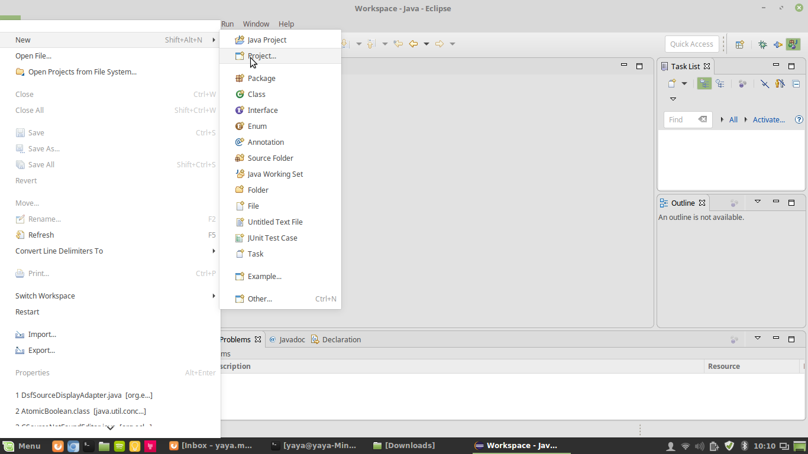
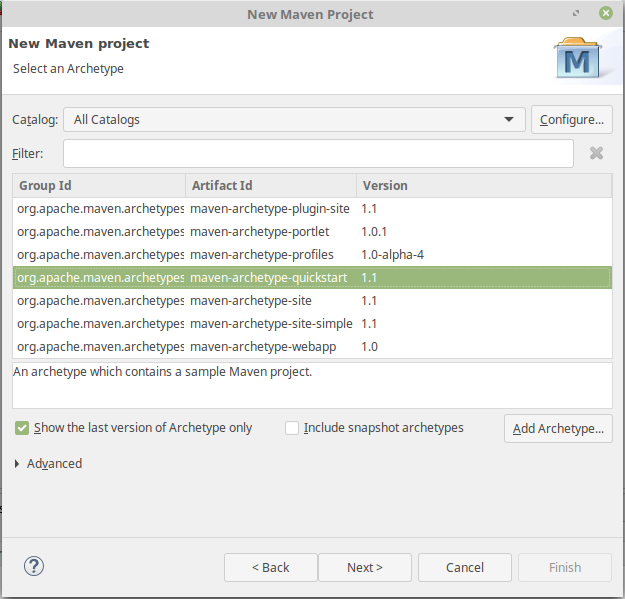
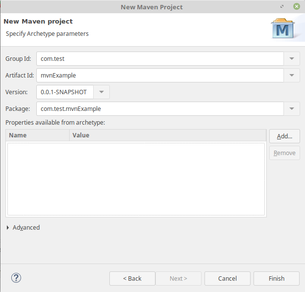
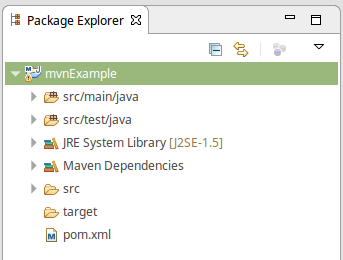
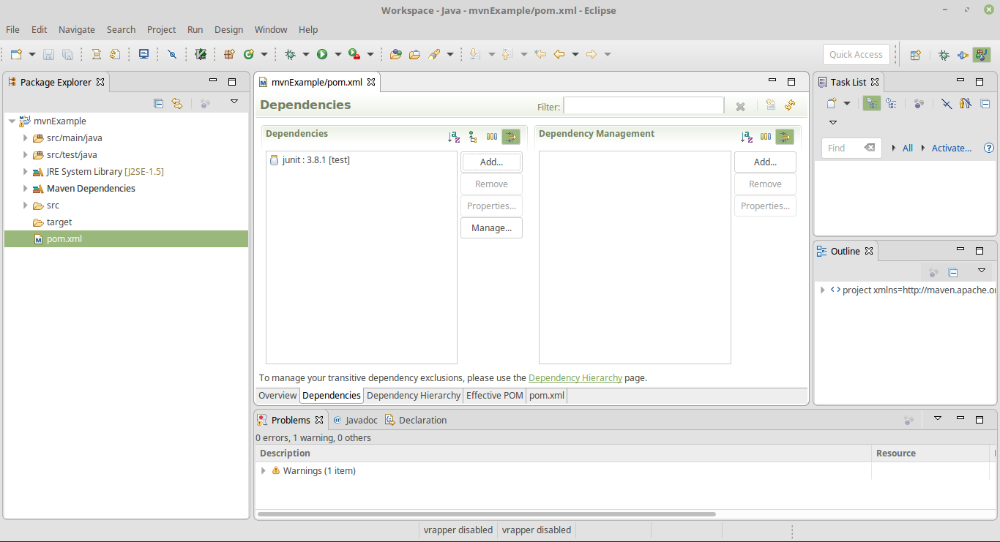

# Eclipse Project using January

## Requirements

* Having
  [Eclipse](https://www.eclipse.org/downloads/packages/eclipse-ide-java-developers/neon3)
installed & basic knowledge on how to use it
* Having **maven** installed
  * On Windows: https://www.mkyong.com/maven/how-to-install-maven-in-windows/
  * On Linux: `apt install maven`
* Having **Java** 7 or more installed
  * On Windows: https://www.java.com/en/download/
  * On Linux: `apt install openjdk-8-jdk` and `apt install openjdk-8-jre`

## How-to

* Create a new maven project in Eclipse

  

  Use the maven-archetype-quickstart archetype or whatever suits your project
best.

  

  Use whatever **Group Id** and **Artifact Id** you want for your project, we
will be using com.test and mvnExample.

  

  You should see the new project in the **Package Explorer**.

  

* Click of the file called pom.xml

  

  Under the depencies tab click on add and complete with following information:
  * Group Id: com.github.yannick-mayeur
  * Artifact Id: org.eclipse.january
  * Version: 2.0.2

* You can now use all the january classes in you project. Here is some example
  code:

  ```java
  Dataset dataset = DatasetFactory.createFromObject(new double[] { 1, 2, 3, 4, 5, 6, 7, 8, 9 });
  // Print the output:
  System.out.println("shape of dataset: " + Arrays.toString(dataset.getShape()));
  System.out.println("toString of dataset: " + dataset.toString());
  System.out.println("toString, with data, of dataset: \n" + dataset.toString(true));
  ```

## Get my project

You can clone my project with git,
`https://github.com/yannick-mayeur/january-eclipse-example.git`, if you want to
check it out.
